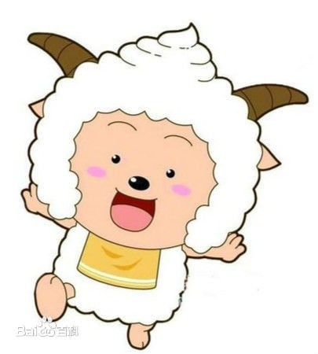
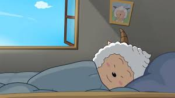
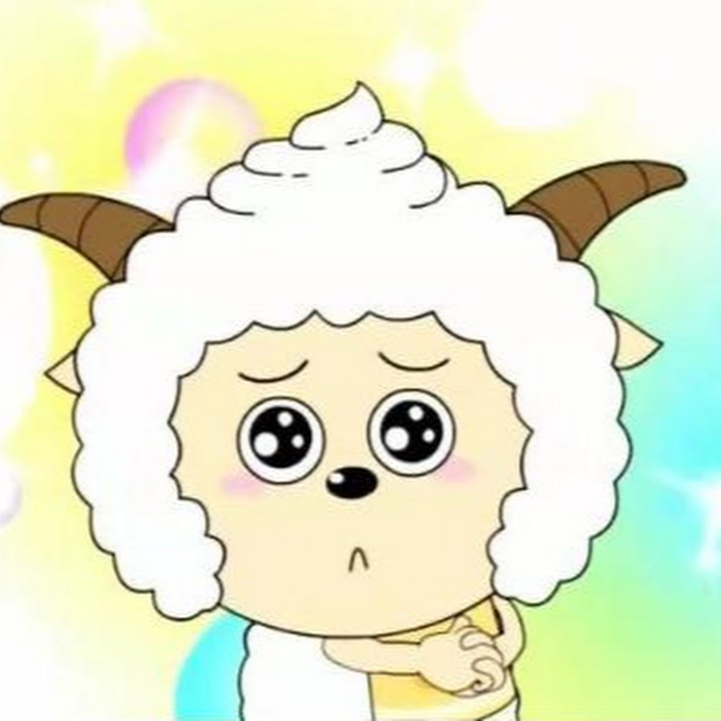

# 懒羊羊

懒羊羊，动画《喜羊羊与灰太狼》中的角色，“草原三剑客”之一。
他是青青草原上最可爱的小羊，同时也是很幸运的小羊，每次遇到危险时，都能化险为夷，一旦闻到食物的香味，马上会被吸引过去。最喜欢吃零食和睡懒觉。

- #### 外文名： Paddi
- #### 性别：男
- #### 生日：羊历3507年6月26日
## 角色背景：
懒羊羊是一只性格很有特点的羊，每次被灰太狼抓住都会意外脱险。懒羊羊不爱运动，喜欢吃零食和睡懒觉，内心善良，大智若愚，关键时刻总是有意想不到的能力，也勇于承担责任帮助大家。
懒羊羊小时候因为无人陪伴其玩耍而爱上了睡觉。最爱做的事情就是吃和睡觉，所以长得圆滚滚的，因此被灰太狼亲切地称为“小胖子”或者“小肥羊”。
无论是生活、学习还是工作，懒羊羊都会随身携带他的最爱——枕头。时不时会被其他小羊冤枉，有时候蛋糕点心之类的东西不见了，其他羊都会认为是懒羊羊偷吃的，但是懒羊羊一直乐观开朗，真诚对待朋友，积极面对羊生。
虽然懒羊羊很懒，但是他却有好运。有时懒羊羊睡懒觉的时候就可以躲开灰太狼的攻击，甚至可以激发出意想不到的潜能帮助同伴打败灰太狼。
## 角色生活：
懒羊羊内心善良，爱护小朋友（如小灰灰），对小朋友温柔细心，会陪他们一起玩而且很有耐心，到了关键的时候在其他小羊没有办法的时候总会有聪明的一面。
在《喜羊羊与灰太狼之羊羊运动会》中，懒羊羊是绵羊队里面看上去完全没有运动细胞的一只小羊，不过让大家意想不到的是他却是本届羊运会中夺金最多的一只绵羊。因此，懒羊羊十分的得意，自称运动天才，这是他在睡梦中总是能做到平时做不到的事情（比如与机械羊进行击剑比赛时，懒羊羊躺在的上睡着了，但是在比赛过程中他总是恰到好处的不断左右翻身，弄得机械羊每次都刺不到懒羊羊，站在不远处的喜羊羊说道：“懒羊羊连睡觉的时候都能赢得比赛）。他有两大爱好，一是吃，二是睡。平日爱吃懒惰，不爱运动，但自尊心却很强，很重视自己生命的价值，不容许别人的笑话，为此他也努力练习过。在羊羊运动会中，懒羊羊竟遇上了跟他一样乌龙的对手——山羊队的小刀羊，两只小羊都不被看好总是被冷眼相待，但是都积极乐观地参加比赛，从不气馁，友好地对待他人，他俩自认为“识英雄重英雄”，还常称呼对方为英雄，并在乒乓球比赛中大战三天三夜，颇有相见恨晚的感觉。
1. 特长：嗅觉敏锐、擅长发现食物、总能不经意间化险为夷、做蜡像（《喜羊羊与灰太狼》第5集）、冥想、第六感（《喜羊羊与灰太狼之羊羊快乐的一年》）、强大的爆发力、烹饪（《喜羊羊与灰太狼之懒羊羊当大厨》开始）、三分球（《喜羊羊与灰太狼之筐出胜利》）、睡梦中可以做任何事情、照顾小朋友
2. 象征颜色：橙色或黄色、绿色
3. 荣誉：屠龙勇士（见《喜羊羊与灰太狼之羊年喜羊羊》）。
4. 优点：善良、嗅觉敏锐、重情重义、总能关键时刻爆发潜能、可爱、随性、大智若愚、勇敢、真诚、纯粹、率真。
缺点：唱歌难听（见《喜羊羊与灰太狼》第53集懒羊羊的歌声）、笑容可怕（《喜羊羊与灰太狼之开心日记》第17集最可爱笑容小羊）、平时护食胆小(但是关键时刻会为了朋友变得无私勇敢，参考懒羊羊外传，开心日记的我要吃肉，给快乐加油的求你吃掉我吧，羊羊快乐的一年的临时爸爸)
1. 爱好：睡觉、吃零食、唱歌、品尝美食、撒娇。

1. 衣着：吊床、口水垫、枕头(平常)。中间有绿色漩涡的白色短袖，领口袖口呈紫色，脖子上挂着金色吊坠，搭配绿色短裤和红白色运动鞋，身材苗条，一幅富家公子模样，兼具帅气与可爱。(见决战次时代官方拟人)
2. 最爱的食物：青草蛋糕(最爱)、松子巧克力、薯片、梦幻蘑菇汤等。
3. 害怕：被冤枉、零食被吃掉或者被没收、被沸羊羊打骂、朋友遗忘、没有生命的意义和价值

## 人际关系
| 关系 | 相关人物 |
|:------:|:-------:|
| 父亲 | 懒爸爸 |  
| 母亲 | 懒妈妈 |  
| 宠物 | 蛋蛋 |  
| 老师/村长 | 慢羊羊 | 
| 最好的朋友 | 小灰灰 喜羊羊 | 
| 同学/朋友 | 喜羊羊、美羊羊、沸羊羊、暖羊羊、小灰灰、小香香、小刀羊、蕉太狼、冰冰羊、忽悠老羊（见《喜羊羊与灰太狼之羊羊运动会》）、小希（见《喜羊羊与灰太狼之奇幻天空岛》）、小木（见《喜羊羊与灰太狼之异国大营救》）、灰太狼、红太狼、狼将军、七大恶狼（《喜羊羊与灰太狼之羊村守护者》之后）、皓月（《喜羊羊与灰太狼之异国大营救》）、兔可爱（《喜羊羊与灰太狼之筐出胜利》）。潇洒哥、黑大帅（《喜羊羊与灰太狼之古古怪界大作战》 | 
| 义兄弟  |  小灰灰、小恐鸟（见《喜羊羊与灰太狼之虎虎生威》小刀羊（见《喜羊羊与灰太狼之羊羊运动会》 |